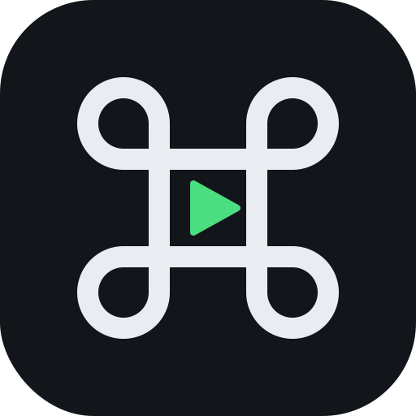

#  macremote

Your Mac, in your pocket. A self-hosted remote: an Android app + home-screen
widget that drives your Mac's media, volume, brightness, lock and sleep — plus
a fall-asleep-to-music sleep timer — over your own Tailscale network.
No cloud. No accounts. No cost.

```text
Android (Expo RN app + widget)
        │  HTTP + bearer token · Tailscale (anywhere) or LAN
        ▼
FastAPI on the Mac — launchd-managed, self-updating, Discord-alerting
        │  Hammerspoon IPC
        ▼
macOS: media keys · volume · brightness · lock · sleep
```

## Features

- ⏯ Media keys (play/pause/next/previous — works with Spotify, YouTube, anything)
- 🔊 Volume: step up/down, mute, absolute slider; ☀️ brightness
- 🔒 Lock / 💤 sleep, and a **sleep timer** that fades the volume out and puts
  the Mac to sleep — cancel any time, live countdown in the app
- 🎵 Now-playing card (Spotify/Music)
- 📟 Home-screen widget: ⏮ ▶️ ⏭ 🔉 🔊 without opening the app
- 🔄 Self-updating on both ends: the app installs new APKs from GitHub
  Releases; the Mac service pulls new tags, restarts, health-checks, rolls back on failure
- 🚨 Discord webhook alerts: errors with tracebacks, updates, releases, CI failures
- ✅ CI-gated releases: no green tests, no APK

## Install

### Mac (server)

```bash
git clone https://github.com/tejasnafde/macremote.git
cd macremote
brew install --cask hammerspoon   # if not installed
cp server/.env.example server/.env   # fill in API_TOKEN (+ optional Discord webhook)
./ops/install.sh
```

Grant Hammerspoon **Accessibility** access when macOS asks
(System Settings → Privacy & Security → Accessibility) — needed for media keys.

### Android (app)

Download the latest `macremote-vX.Y.Z.apk` from
[Releases](https://github.com/tejasnafde/macremote/releases), install it
(allow "install unknown apps"), then in Settings enter your server URL and API token.
The app self-updates from Releases afterwards.

### Anywhere access (optional but great)

Install [Tailscale](https://tailscale.com) on both devices, log into the same
tailnet, and use `http://<mac-tailscale-name>:8484` as the server URL.
Works from any network; nothing is ever exposed to the public internet.

## API

| Endpoint | Auth | Does |
|---|---|---|
| `POST /media/{playpause,next,previous}` | ✅ | media keys |
| `POST /volume/{up,down,mute}` · `PUT /volume {level}` | ✅ | volume |
| `POST /brightness/{up,down}` | ✅ | brightness |
| `POST /system/{lock,sleep}` | ✅ | lock / sleep now |
| `POST /sleep-timer {minutes}` · `DELETE /sleep-timer` | ✅ | fade-out sleep timer |
| `GET /status` | ✅ | volume, brightness, battery, now-playing, timer |
| `GET /health` · `GET /version` | — | liveness / version |

Auth = `Authorization: Bearer <API_TOKEN>`. Tailscale is the outer wall; the
token is defense-in-depth.

## Development

```bash
cd server && uv sync && uv run pytest          # server tests (Hammerspoon shimmed)
APP_ENV=dev uv run uvicorn main:app --reload   # dev server
scripts/e2e_mac.sh                             # real end-to-end on your Mac
cd app && npm install && npm run typecheck     # app
scripts/ship.sh 0.2.0                          # release: tag → CI → APK → Discord
```

Design & plan: [`docs/plans/`](docs/plans/). Ops conventions: [`CLAUDE.md`](CLAUDE.md).

## License

MIT — see [LICENSE](LICENSE).
